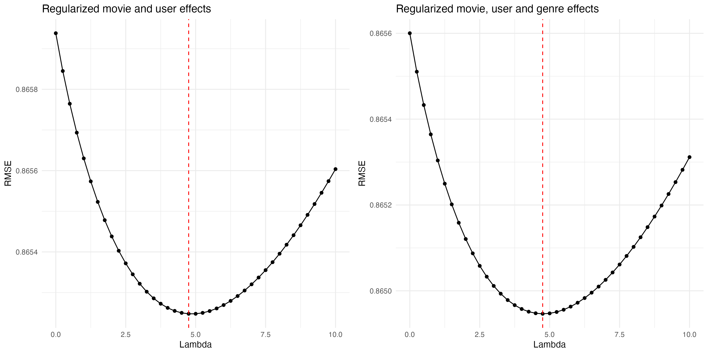
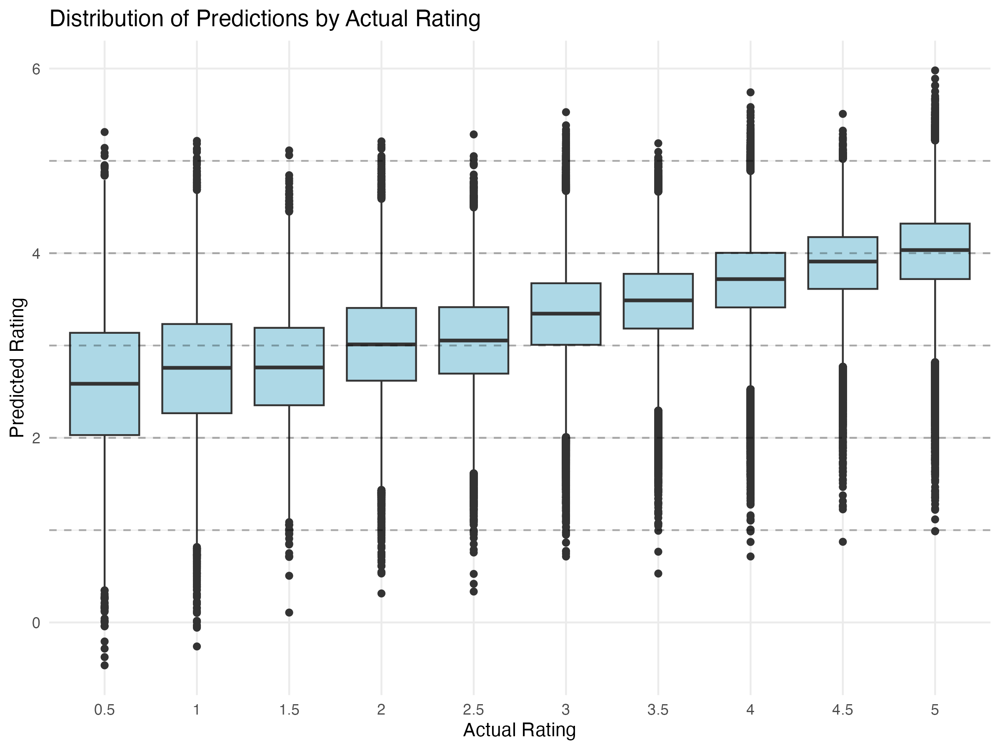

```{r setup, include=FALSE}
knitr::opts_chunk$set(
  echo = FALSE,        # Don't show code by default
  message = FALSE,     # Don't show messages
  warning = FALSE,     # Don't show warnings
  fig.align = "center" # Center figures
)
```

```{r load_libraries, include=FALSE}

# Install packages if not already installed
if (!require(magick)) install.packages("magick")
if (!require(tidyverse)) install.packages("tidyverse")
if (!require(caret)) install.packages("caret")
if (!require(knitr)) install.packages("knitr")
if (!require(kableExtra)) install.packages("kableExtra")
if (!require(ggplot2)) install.packages("ggplot2")

library(tidyverse)
library(knitr)
library(kableExtra)    # For nicer table formatting
library(ggplot2)
library(magick)
library(caret)

# Load the R script that creates the model objects
#source("movie-lens-code.R") Sourcing the code didn't work because of the time taken to run the models. Instead, I've used code chunks in the Markdown notebook.

# To knit final file to PDF use: rmarkdown::render("movie-lens-report.Rmd")
```

```{r data_download, echo=FALSE, message=FALSE, warning=FALSE, results='hide'}
###############################################################
# PART 1: DATA PREPARATION
###############################################################

##########################################################
# Create edx and final_holdout_test sets 
##########################################################

# Note: this code was provided as part of the course assessment

# MovieLens 10M dataset:
# https://grouplens.org/datasets/movielens/10m/
# http://files.grouplens.org/datasets/movielens/ml-10m.zip

options(timeout = 120)

dl <- "ml-10M100K.zip"
if(!file.exists(dl))
  download.file("https://files.grouplens.org/datasets/movielens/ml-10m.zip", dl)

ratings_file <- "ml-10M100K/ratings.dat"
if(!file.exists(ratings_file))
  unzip(dl, ratings_file)

movies_file <- "ml-10M100K/movies.dat"
if(!file.exists(movies_file))
  unzip(dl, movies_file)
```

```{r data_processing, echo=FALSE, message=FALSE, warning=FALSE, results='hide'}
# Read and format the ratings data from the DAT file
ratings <- as.data.frame(str_split(read_lines(ratings_file), fixed("::"), simplify = TRUE),
                        stringsAsFactors = FALSE)
colnames(ratings) <- c("userId", "movieId", "rating", "timestamp")
ratings <- ratings %>%
  mutate(userId = as.integer(userId),
         movieId = as.integer(movieId),
         rating = as.numeric(rating),
         timestamp = as.integer(timestamp))

# Read and format the movies data from the DAT file
movies <- as.data.frame(str_split(read_lines(movies_file), fixed("::"), simplify = TRUE),
                       stringsAsFactors = FALSE)
colnames(movies) <- c("movieId", "title", "genres")
movies <- movies %>%
  mutate(movieId = as.integer(movieId))

# Join ratings and movies data to create the complete dataset
movielens <- left_join(ratings, movies, by = "movieId")
```

```{r data_partition, echo=FALSE, message=FALSE, warning=FALSE, results='hide'}

# Create train/test split for model evaluation
# Final hold-out test set will be 10% of MovieLens data
set.seed(1, sample.kind="Rounding") # if using R 3.6 or later
# set.seed(1) # if using R 3.5 or earlier
test_index <- createDataPartition(y = movielens$rating, times = 1, p = 0.1, list = FALSE)
edx <- movielens[-test_index,]
temp <- movielens[test_index,]

# Make sure userId and movieId in final hold-out test set are also in edx set
# This ensures we don't test on users or movies we haven't seen during training
final_holdout_test <- temp %>% 
  semi_join(edx, by = "movieId") %>%
  semi_join(edx, by = "userId")

# Add rows removed from final hold-out test set back into edx set
removed <- anti_join(temp, final_holdout_test)
edx <- rbind(edx, removed)

rm(dl, ratings, movies, test_index, temp, movielens, removed)
```

```{r data_partition_train_test, echo=FALSE, message=FALSE, warning=FALSE, results='hide'}
# Split data for model development
# - edx_train (80% of edx): Used to train the models
# - validation (20% of edx): Used to tune and evaluate model performance
# - final_holdout_test: Completely separate dataset used only for final evaluation

set.seed(1, sample.kind="Rounding")
validation_index <- createDataPartition(y = edx$rating, times = 1, p = 0.2, list = FALSE) # uses createDataPartition() with p = 0.2 to select 20% of the rows from edx
validation <- edx[validation_index,]
edx_train <- edx[-validation_index,]
```

```{r baseline_model, echo=FALSE, message=FALSE, warning=FALSE, results='hide'}
# PART 2: MODEL DEVELOPMENT STRATEGY
#
# We use a progressive approach to build our recommendation system:
# 1. Baseline model: Global mean rating
# 2. Movie effects model: Accounts for movie popularity
# 3. User effects model: Accounts for user rating tendencies
# 4. Combined model: Incorporates both movie and user effects
# 5. Regularized model: Prevents overfitting with regularization
# 6. Genre effects: Adds genre-based preferences
#
# For each model, we:
#   - Train on the edx_train dataset
#   - Evaluate on the validation dataset
#   - Compare performance using RMSE (Root Mean Square Error)
###############################################################

# Split data for model development
# - edx_train (80% of edx): Used to train the models
# - validation (20% of edx): Used to tune and evaluate model performance
# - final_holdout_test: Completely separate dataset used only for final evaluation

set.seed(1, sample.kind="Rounding")
validation_index <- createDataPartition(y = edx$rating, times = 1, p = 0.2, list = FALSE) # uses createDataPartition() with p = 0.2 to select 20% of the rows from edx
validation <- edx[validation_index,]
edx_train <- edx[-validation_index,]
```

```{r baseline_model_setup, echo=FALSE, message=FALSE, warning=FALSE, results='hide'}
# PART 3: BASELINE MODEL
# 
# The simplest possible model: predict the same rating (overall mean)
# for every movie and user. This establishes a performance floor
# that more complex models should improve upon.
###############################################################

## Step 1: Calculate the mean rating (μ)

# Calculate the overall mean rating from training data
mu <- mean(edx_train$rating)
print(paste("Overall mean rating:", round(mu, 4)))


## Step 2: Create predictions for validation set

# Create predictions using just the mean (mu) from the previous step
predictions <- rep(mu, nrow(validation))


## Step 3: Define RMSE function and calculate error

# Define RMSE (Root Mean Square Error) function
# RMSE measures the average magnitude of prediction errors
# Lower RMSE values indicate better prediction accuracy
# 
# Parameters:
#   true_ratings: Vector of actual ratings from users
#   predicted_ratings: Vector of model-predicted ratings
# 
# Returns:
#   Numeric value representing prediction error (lower is better)
RMSE <- function(true_ratings, predicted_ratings){
  sqrt(mean((true_ratings - predicted_ratings)^2))
}

# Calculate RMSE for baseline model
# Print the mean rating with 4 decimal places for clarity
naive_rmse <- RMSE(validation$rating, predictions)
print(paste("RMSE for baseline model:", round(naive_rmse, 4)))


## Step 4: Create results table to track model performance

# Create results table
rmse_results <- tibble(
  Method = "Baseline model",
  RMSE = naive_rmse
)

knitr::kable(rmse_results, digits = 4, 
             caption = "Baseline model performance")
```

```{r movie_effects, echo=FALSE, message=FALSE, warning=FALSE, results='hide'}
# PART 4: MOVIE EFFECTS MODEL
# 
# This model accounts for the fact that some movies are generally
# rated higher or lower than others, regardless of who rates them.
# 
# For each movie i:
#   b_i = average(rating - μ)
# 
# Where:
#   μ is the global average rating
#   b_i is the "movie effect" or movie bias
# 
# Prediction formula:
#   predicted_rating = μ + b_i
###############################################################

# Calculate global mean (as previously)
mu <- mean(edx_train$rating)

# Calculate movie effect (b_i)
# Group by movie and calculate the average deviation from the mean rating
movie_avgs <- edx_train %>%
   group_by(movieId) %>%
   summarize(b_i = mean(rating - mu))

# Predict ratings using global mean + movie effect
predicted_ratings <- validation %>%
  left_join(movie_avgs, by = "movieId") %>%
  mutate(
    # Replace NA movie effects with 0 (global mean), in case some movies are in the validation set but not the training set
    b_i = ifelse(is.na(b_i), 0, b_i),
    pred = mu + b_i
  ) %>% 
  pull(pred)

# Calculate Root Mean Square Error (RMSE)
movie_effect_rmse <- RMSE(validation$rating, predicted_ratings)

# Print results
print(paste("Movie Effects RMSE:", movie_effect_rmse))

# Calculate improvement over naive RMSE
improvement <- naive_rmse - movie_effect_rmse
improvement_percentage_movie_effects <- (naive_rmse - movie_effect_rmse) / naive_rmse * 100

# Add to results table
rmse_results <- bind_rows(rmse_results,
                         tibble(Method = "Movie Effects Model",
                                RMSE = movie_effect_rmse))
```

```{r user_effects, echo=FALSE, message=FALSE, warning=FALSE, results='hide'}
# PART 5: USER EFFECTS MODEL
# 
# This model accounts for the fact that some users tend to rate
# movies higher or lower than the average user.
# 
# For each user u:
#   b_u = average(rating - μ)
# 
# Prediction formula:
#   predicted_rating = μ + b_u
###############################################################

# Calculate user-specific effects (b_u)
user_avgs <- edx_train %>%
   group_by(userId) %>%
   summarize(b_u = mean(rating - mu))

# Predict ratings using global mean + user effect
predicted_ratings <- validation %>%
  left_join(user_avgs, by = "userId") %>%
  mutate(
    # Handle missing users
    b_u = ifelse(is.na(b_u), 0, b_u),
    pred = mu + b_u
  ) %>% 
  pull(pred)

# Calculate RMSE
user_effect_rmse <- RMSE(validation$rating, predicted_ratings)

print(paste("User Effects RMSE:", user_effect_rmse))

# Calculate improvement over naive RMSE
improvement <- naive_rmse - user_effect_rmse
improvement_percentage_user_effects <- (naive_rmse - user_effect_rmse) / naive_rmse * 100

# Add to results
rmse_results <- bind_rows(rmse_results,
                         tibble(Method = "User Effects Model",
                                RMSE = user_effect_rmse))

# Display results table
knitr::kable(rmse_results, digits = 4,
             caption = "Model performance on validation set")  
```

```{r combined_effects, echo=FALSE, message=FALSE, warning=FALSE, results='hide'}
# PART 6: COMBINED MOVIE AND USER EFFECTS MODEL
# 
# This model incorporates both movie and user biases for more
# accurate predictions.
# 
# Model components:
#   μ: Global mean rating
#   b_i: Movie effect for movie i
#   b_u: User effect for user u
# 
# Prediction formula:
#   predicted_rating = μ + b_i + b_u
###############################################################

# Calculate global mean (as previously)
mu <- mean(edx_train$rating)

# Calculate movie effects (as previously)
movie_avgs <- edx_train %>%
  group_by(movieId) %>%
  summarize(b_i = mean(rating - mu))

# Calculate user effects accounting for movie effects
# This ensures we don't double-count effects
user_avgs <- edx_train %>%
  left_join(movie_avgs, by = "movieId") %>%
  group_by(userId) %>%
  summarize(b_u = mean(rating - mu - b_i))


# Make predictions on validation set
predicted_ratings <- validation %>%
  left_join(movie_avgs, by = "movieId") %>%
  left_join(user_avgs, by = "userId") %>%
  mutate(
    b_i = ifelse(is.na(b_i), 0, b_i),
    b_u = ifelse(is.na(b_u), 0, b_u),
    pred = mu + b_i + b_u
  ) %>%
  pull(pred)

# Calculate RMSE
combined_effect_rmse <- RMSE(validation$rating, predicted_ratings)
print(paste("Combined Effects RMSE (validation):", combined_effect_rmse))

# Calculate improvement over naive RMSE
improvement <- naive_rmse - combined_effect_rmse
improvement_percentage_combined_effects <- (naive_rmse - combined_effect_rmse) / naive_rmse * 100

# Add to results
rmse_results <- bind_rows(rmse_results,
                         tibble(Method = "Combined Effects Model",
                                RMSE = combined_effect_rmse))

# Display results table
knitr::kable(rmse_results, digits = 4,
             caption = "Model performance on validation set")
```

```{r regularized_model_setup, echo=FALSE, message=FALSE, warning=FALSE, results='hide'}
#PART 7: REGULARIZED MODEL
# 
# Regularization penalizes extreme estimates that may be based on
# small sample sizes. This helps prevent overfitting.
# 
# For movie effects:
#   b_i = sum(rating - μ)/(n_i + λ)
# 
# For user effects:
#   b_u = sum(rating - μ - b_i)/(n_u + λ)
# 
# Where:
#   n_i = number of ratings for movie i
#   n_u = number of ratings by user u
#   λ = regularization parameter
#
# We test different λ values to find the optimal balance between
# fitting the training data and generalizing to new data.
###############################################################

# Create a container list for all model components
movie_model <- list()

# Test a range of lambda values for regularization
movie_model$lambdas <- seq(0, 10, 0.25)
movie_model$rmses <- sapply(movie_model$lambdas, function(l){
  
  # Regularized movie effects
  movie_reg_avgs <- edx_train %>%
    group_by(movieId) %>%
    summarize(
      b_i = sum(rating - mu)/(n() + l),
      n_i = n()
    )
  
  # Regularized user effects
  user_reg_avgs <- edx_train %>%
    left_join(movie_reg_avgs, by = "movieId") %>%
    group_by(userId) %>%
    summarize(
      b_u = sum(rating - mu - b_i)/(n() + l),
      n_u = n()
    )
  
  # Make predictions
  predicted_ratings <- validation %>%
    left_join(movie_reg_avgs, by = "movieId") %>%
    left_join(user_reg_avgs, by = "userId") %>%
    mutate(
      b_i = ifelse(is.na(b_i), 0, b_i),
      b_u = ifelse(is.na(b_u), 0, b_u),
      pred = mu + b_i + b_u
    ) %>%
    pull(pred)
  
  return(RMSE(validation$rating, predicted_ratings))
})

```

```{r optimal_lambda, echo=FALSE, message=FALSE, warning=FALSE, results='hide'}
# Find optimal lambda and save model components
movie_model$optimal_lambda <- movie_model$lambdas[which.min(movie_model$rmses)]
print(paste("Optimal lambda:", movie_model$optimal_lambda))
```

```{r final_effects, echo=FALSE, message=FALSE, warning=FALSE, results='hide'}
# Save final effects using optimal lambda
movie_model$movie_effects <- edx_train %>%
  group_by(movieId) %>%
  summarize(
    b_i = sum(rating - mu)/(n() + movie_model$optimal_lambda),
    n_i = n()
  )

movie_model$user_effects <- edx_train %>%
  left_join(movie_model$movie_effects, by = "movieId") %>%
  group_by(userId) %>%
  summarize(
    b_u = sum(rating - mu - b_i)/(n() + movie_model$optimal_lambda),
    n_u = n()
  )

# Plot RMSE vs lambda to visualize the impact of regularization
initial_reg_plot <- qplot(movie_model$lambdas, movie_model$rmses) +
  geom_line() +
  geom_vline(xintercept = movie_model$optimal_lambda, color = "red", linetype = "dashed") +
  xlab("Lambda") +
  ylab("RMSE") +
  ggtitle("Regularized movie and user effects") +
  theme_minimal()

# Save plots as PNG files
ggsave("initial_reg_plot.png", initial_reg_plot, width = 8, height = 6)


# Plot RMSE vs lambda to visualize the impact of regularization
#qplot(movie_model$lambdas, movie_model$rmses) +
  #geom_line() +
  #xlab("Lambda") +
  #ylab("RMSE") +
  #ggtitle("RMSE vs Regularization Parameter")

# Add results to the comparison table
rmse_results <- bind_rows(rmse_results,
                         tibble(Method = "Regularized Model",
                                RMSE = min(movie_model$rmses)))

# Display updated results
knitr::kable(rmse_results, digits = 4,
             caption = "Model performance on validation set")
```

```{r genre_effects, echo=FALSE, message=FALSE, warning=FALSE, results='hide'}
# PART 8: GENRE EFFECTS MODEL WITH REGULARIZATION
###############################################################

# Test a range of lambda values for all effects
lambdas <- seq(0, 10, 0.25)
rmses <- sapply(lambdas, function(l){
  
  # Regularized movie effects
  movie_reg_avgs <- edx_train %>%
    group_by(movieId) %>%
    summarize(
      b_i = sum(rating - mu)/(n() + l),
      n_i = n()
    )
  
  # Regularized user effects
  user_reg_avgs <- edx_train %>%
    left_join(movie_reg_avgs, by = "movieId") %>%
    group_by(userId) %>%
    summarize(
      b_u = sum(rating - mu - b_i)/(n() + l),
      n_u = n()
    )
  
  # Regularized genre effects
  genre_reg_avgs <- edx_train %>%
    left_join(movie_reg_avgs, by = "movieId") %>%
    left_join(user_reg_avgs, by = "userId") %>%
    group_by(genres) %>%
    summarize(
      b_g = sum(rating - mu - b_i - b_u)/(n() + l),
      n_g = n()
    )
  
  # Make predictions
  predicted_ratings <- validation %>%
    left_join(movie_reg_avgs, by = "movieId") %>%
    left_join(user_reg_avgs, by = "userId") %>%
    left_join(genre_reg_avgs, by = "genres") %>%
    mutate(
      b_i = ifelse(is.na(b_i), 0, b_i),
      b_u = ifelse(is.na(b_u), 0, b_u),
      b_g = ifelse(is.na(b_g), 0, b_g),
      pred = mu + b_i + b_u + b_g
    ) %>%
    pull(pred)
  
  return(RMSE(validation$rating, predicted_ratings))
})
```

```{r genre_lambda, echo=FALSE, message=FALSE, warning=FALSE, results='hide'}
# Find optimal lambda and save model components
optimal_lambda <- lambdas[which.min(rmses)]
print(paste("Optimal lambda:", optimal_lambda))
```

```{r final_predictions, echo=FALSE, message=FALSE, warning=FALSE, results='hide'}
# Save final effects using optimal lambda
final_movie_effects <- edx_train %>%
  group_by(movieId) %>%
  summarize(
    b_i = sum(rating - mu)/(n() + optimal_lambda),
    n_i = n()
  )

final_user_effects <- edx_train %>%
  left_join(final_movie_effects, by = "movieId") %>%
  group_by(userId) %>%
  summarize(
    b_u = sum(rating - mu - b_i)/(n() + optimal_lambda),
    n_u = n()
  )

final_genre_effects <- edx_train %>%
  left_join(final_movie_effects, by = "movieId") %>%
  left_join(final_user_effects, by = "userId") %>%
  group_by(genres) %>%
  summarize(
    b_g = sum(rating - mu - b_i - b_u)/(n() + optimal_lambda),
    n_g = n()
  )

# Save final model regularization plot as object
final_reg_plot <- qplot(lambdas, rmses) +
  geom_line() +
  geom_vline(xintercept = optimal_lambda, color = "red", linetype = "dashed") +
  xlab("Lambda") +
  ylab("RMSE") +
  ggtitle("Regularized movie, user and genre effects") +
  theme_minimal()

ggsave("final_reg_plot.png", final_reg_plot, width = 8, height = 6)

# Make final predictions including genre effects
predicted_ratings_with_genre <- validation %>%
  left_join(final_movie_effects, by = "movieId") %>%
  left_join(final_user_effects, by = "userId") %>%
  left_join(final_genre_effects, by = "genres") %>%
  mutate(
    b_i = ifelse(is.na(b_i), 0, b_i),
    b_u = ifelse(is.na(b_u), 0, b_u),
    b_g = ifelse(is.na(b_g), 0, b_g),
    pred = mu + b_i + b_u + b_g
  )

# Calculate final RMSE
final_rmse <- RMSE(validation$rating, predicted_ratings_with_genre$pred)

# Add to results
rmse_results <- bind_rows(rmse_results,
                         tibble(Method = "Optimized Regularized Model with Genre Effects",
                                RMSE = final_rmse))

# Display updated results
knitr::kable(rmse_results, digits = 4,
             caption = "Model performance on validation set")
```

```{r regularization_plots, echo=FALSE, message=FALSE, warning=FALSE, results='hide', dependson=c("final_effects", "final_predictions")}
# Create a single figure with both regularization plots using cowplot
if (!require(cowplot)) install.packages("cowplot")
library(cowplot)

# Combine the two ggplot objects side by side
combined_plot <- plot_grid(initial_reg_plot, final_reg_plot, ncol = 2, align = "h")

# Save the combined plot as a PNG
# Note: cowplot::save_plot is preferred for cowplot objects
save_plot("combined_reg_plots.png", combined_plot, base_width = 12, base_height = 6)
```

```{r visualization, echo=FALSE, message=FALSE, warning=FALSE, results='hide'}
# PART 10: VISUALIZATIONS AND ANALYSIS
# 
# These visualizations help understand model performance and
# identify potential areas for improvement:
# 1. RMSE vs regularization parameter (lambda)
# 2. Distribution of effects by genre
# 3. Predicted vs. actual ratings
# 4. Distribution of predictions by actual rating
###############################################################


# Plot distribution of effects by genre
final_genre_effects_plot <- ggplot(final_genre_effects, aes(x = reorder(genres, b_g, FUN = median), y = b_g)) +
  geom_boxplot() +
  theme_minimal() +
  theme(axis.text.x = element_text(angle = 45, hjust = 1)) +
  labs(title = "Distribution of Genre Effects",
       x = "Genre",
       y = "Effect Size")

ggsave("final_genre_effects.png", final_genre_effects_plot, width = 8, height = 6)
# Display final model comparison results
print("Final model comparison:")
print(knitr::kable(rmse_results, digits = 4))
```

```{r final_evaluation, echo=FALSE, message=FALSE, warning=FALSE, results='hide'}
# PART 11: FINAL EVALUATION
# 
# Apply the best-performing model to the final holdout test set
# to get an unbiased estimate of model performance.
# 
# The final RMSE represents how well our model would perform
# on new, unseen data.
###############################################################

# Make final predictions on holdout set using the best model
# (Regularized model with genre effects)
final_predictions <- final_holdout_test %>%
  left_join(final_movie_effects, by = "movieId") %>%
  left_join(final_user_effects, by = "userId") %>%
  left_join(final_genre_effects, by = "genres") %>%
  mutate(
    b_i = ifelse(is.na(b_i), 0, b_i),
    b_u = ifelse(is.na(b_u), 0, b_u),
    b_g = ifelse(is.na(b_g), 0, b_g),
    pred = mu + b_i + b_u + b_g
  )


# Calculate final RMSE
final_holdout_rmse <- RMSE(final_holdout_test$rating, final_predictions$pred)

# Add to results table
rmse_results <- bind_rows(rmse_results,
                         tibble(Method = "Final Model on Holdout",
                                RMSE = final_holdout_rmse))

# Display final results
knitr::kable(rmse_results, digits = 4,
             caption = "Final Model Performance on Holdout Set")
```

```{r boxplot, echo=FALSE, message=FALSE, warning=FALSE, results='hide'}
# Create boxplot of predictions for each actual rating value
boxplot <- ggplot(final_predictions, aes(x = factor(rating), y = pred)) +
  geom_boxplot(fill = "lightblue") +
  labs(x = "Actual Rating", 
       y = "Predicted Rating",
       title = "Distribution of Predictions by Actual Rating") +
  theme_minimal() +
  geom_hline(yintercept = seq(1, 5, 1), linetype = "dashed", alpha = 0.3)

# Save the plot
ggsave("boxplot.png", boxplot, width = 8, height = 6)
```

## 1. Introduction

### Recommendation systems

Recommendation systems use ratings provided by users to generate personalized suggestions. Organizations like Amazon, with extensive product catalogs and customer bases, accumulate vast datasets of user ratings. These large datasets can be used to train models that predict how a specific user might rate items they haven't seen before. Items predicted to receive high ratings from a particular user are then recommended to them by the organization to drive sales.[@irizarry2024]

In the entertainment industry, Netflix uses recommendation systems to predict user movie ratings on a five-star scale, where one star indicates a poor film and five stars represents an excellent film.[@irizarry2024] The objective of this project was to develop a machine learning model to predict movie ratings.[@Re3data.Org2016]

### The MovieLens dataset

While Netflix's proprietary data are unavailable, the GroupLens research laboratory has developed an alternative open-source dataset called MovieLens with over 20 million ratings for more than 27,000 movies, provided by over 138,000 users.[@Re3data.Org2016] A subset of these data (MovieLens 10M) were made available for this project via the `dslabs package`.[@dslabs:2017]

The MovieLens 10M dataset contains approximately 10 million ratings applied to 10,000 movies by 72,000 users. The dataset includes user IDs, movie IDs, ratings (0.5-5 stars), timestamps, movie titles, and genres. Each movie can belong to multiple genres (e.g., "Comedy\|Romance\|Drama").[@Zhuo2024]

### Project goal

The goal of the project was to develop several movie recommendation models to develop a system that accurately predicts how users will rate movies they haven't seen yet. To compare the performance of the models I used the Root Mean Square Error (RMSE) metric.

-   Target: Achieve RMSE \< 0.86490 on the final holdout test set

<!-- Final I got was RMSE0.8653 -->

### Key steps

I implemented five key steps to develop and evaluate the movie recommender model:

1.  Data preparation and partitioning into training, validation, and test sets
2.  Progressive model building from simple baseline to complex models
3.  Feature engineering to incorporate movie, user, and genre effects
4.  Regularization to prevent overfitting
5.  Final model evaluation on a separate holdout test set

## 2. Methods

### Data preparation

First, I downloaded and extracted the MovieLens 10M dataset according to the course instructions provided by edX. An essential next step was to join the ratings data with movie metadata. This process created a comprehensive dataset containing both user ratings and detailed information about each movie.

To perform the joining of the datasets, I loaded two separate data files:

1.  `ratings.dat` - Contained user ratings with columns: userId, movieId, rating, and timestamp

2.  `movies.dat` - Contained movie information with columns: movieId, title, and genres

After loading and formatting these files into data frames, I performed a left join operation using the `movieId` column as the common key:

`movielens <- left_join(ratings, movies, by = "movieId")`

This join operation merged the two datasets together, keeping all rows from the ratings dataset and matching them with corresponding movie information from the movies dataset. The resulting `movielens` dataset contained all original rating information plus the additional movie metadata (title and genres) for each rating entry. This unified dataset served as the foundation for all subsequent data partitioning (into training, validation, and test sets) and model development.

### Data partitioning

To ensure best practices in machine learning, data partitioning maintained separate datasets for training, validation, and final testing to get unbiased performance estimates. First, I created two distinct datasets by using `set.seed()` for reproducibility and the `createDataPartition()` function from the `caret` package:

-   90% for model development (`edx`)

-   10% for final evaluation (`final_holdout_test`)

The `edx` dataset was further partitioned into:

-   Training set (`edx_train`): Used to build and train the models (80% of the `edx` data)

-   Validation set: Used to tune hyperparameters and compare model performance (20% of the `edx data`)

The final holdout test set was reserved exclusively for final model evaluation.

Following these partitioning steps, I ensured data integrity by using a `semi-join` to ensure all users and movies in the test sets also appeared in the training set, preventing "cold start" prediction scenarios: any removed rows were added back to the `edx` dataset.

### Modeling approach

In summary, I implemented a methodical approach to model development by progressively adding complexity:

1.  **Baseline model**: Used global mean rating for all predictions

2.  **Movie effects model**: Added movie-specific bias terms

3.  **User effects model**: Added user-specific rating tendencies

4.  **Combined model**: Integrated both movie and user effects

5.  **Regularized combined model**: Added regularization to prevent overfitting

6.  **Regularized genre effects model**: Included genre-specific biases

#### Baseline model

This is a very simple model that ignores individual differences between movies and users and predicts the same rating (global mean, μ) for every movie-user combination. It serves as a baseline that more sophisticated models should improve upon. To implement this model, I first calculated the global mean rating (μ) from the training data and then created predictions by repeating this mean for every rating in the validation set using `rep(mu, nrow(validation))` to create predictions. To validate the model, I defined an RMSE (Root Mean Square Error) function to measure prediction accuracy on the validation set.

Mathematically, RMSE is represented as:

$\text{RMSE} = \sqrt{\frac{1}{n}\sum_{i=1}^{n}(y_i - \hat{y}_i)^2}$

Where:

-   $n$ is the number of predictions

-   $y_i$ is the actual observed value

-   $\hat{y}_i$ is the predicted value

-   i is an index that runs from 1 to n (the total number of predictions)

-   The summation (∑) adds up the squared differences for all predictions from i=1 to i=n

#### **Movie effects model**

This model improved upon the [Baseline model] by accounting for movie-specific variations, recognizing that some movies are consistently rated higher/lower than others and by adding movie bias terms to the global mean.

To implement the movie effects model, as in the baseline model, I first calculated μ (mu) as the overall mean rating from the training data. I then grouped the data by `movieId` and for each movie, calculated b_i (movie effect) as the average deviation from the global mean: b_i = mean(rating - μ) for each movie.

To generate predictions, I used `left_join` to join all the rows in the validation set with those in `movie_avgs` (which contained the movie effects) using the `movieId` to bring in the corresponding movie effect (b_i). To handle missing values for movie effect, which are movies not seen before, the NAs were replaced with 0 so that the prediction fell back to the global mean (μ). This ensured that every movie in the validation set gets a prediction, known movies got predictions based on their historical data and previously unseen movies received a safe fallback to the global mean. The final prediction formula was:

$predicted rating = μ + b_i$

Where μ is the global mean rating (constant for all predictions) and b_i is the movie-specific effect (different for each movie).

#### **User effects model**

This model improved upon the [Baseline model] by accounting for user-specific rating tendencies. This recognized that some users consistently rate movies higher/lower than others and so adds user bias terms to the global mean. For example, if a user typically rated movies 0.5 stars above average, their user effect (b_u) would be 0.5 and so future predictions for this user would add 0.5 to the global mean.

As previously, the global mean (μ) was used and, similarly to the [Movie effects model], the user effect (b_u) calculated as the average deviation from the global mean. To capture how much each user tended to rate above or below the average, for each user, I calculated the user effect as the average deviation from the global mean: b_u = mean(rating - μ) for each user.

To generate predictions I used `left_join` to join all the rows in the validation dataset with `user_avgs`, which contained each user's bias term (b_u), this time matching on `userId` to provide the corresponding user effect. Missing values were handled as described previously. The final prediction formula was:

$predicted rating = μ + b_u$

Where μ is the global mean rating (constant for all predictions) and b_u is the movie-specific effect (different for each user).

#### **Combined movie and user effects model**

This model improved upon previous models by combining both movie and user biases, accounting for both movie quality and user rating tendencies. The model first calculated movie effects, then user effects and then joined both these to the validation data, first adding movie effects by matching on `movieId` and then adding user effects joining on `userId`. Missing values were handled as described previously. The final prediction formula was:

$predicted rating = μ + b_i + b_u$

Where μ is global mean, b_i is the movie-specific effect and b_u is user-specific effect. For example if μ = 3.5, b_i = 0.3 (good movie), and b_u = 0.2 (generous rater), then the prediction would be 4.0 (3.5 + 0.3 + 0.2).

#### **Regularized model**

This model improved upon the combined model by adding regularization to prevent overfitting. Regularization helps stabilize the model by penalizing large coefficients (extreme values), reducing their impact on predictions. To implement this model, I first modified the movie effects model to include the regularization parameter (λ, lambda) which controls the penalty for large coefficients, and then to the user effects model. λ values from 0 to 10 in steps of 0.25 (`seq(0, 10, 0.25)`) were tested for each model. I then joined both these to the validation data, first adding movie effects by matching on `movieId` and then adding user effects joining on `userId`. Missing values were handled as described previously. Note that regularization was applied during the calculation of each effect, not after combining them. The final prediction formula was:

$rating = μ + b_i + b_u$ (but now both b_i and b_u are regularized)

Where: μ is global mean, b_i is movie-specific effect, b_u is user-specific effect

Predictions were made on the validation data and the RMSE computed for each lambda value (model tuning). The lambda value with the lowest RMSE was selected as the optimal lambda, representing the best balance between overfitting and maintaining predicitve power. This optimal lambda was then used to make predictions on the final holdout test set.

#### **Regularized genre effects model**

The regularized genre effects model builds upon the previous models by incorporating and optimizing regularization for all three effects simultaneously: `movie (b_i)`, user `(b_u)`, and genre `(b_g)` effects. The model tests λ values from 0 to 10 in steps of 0.25 to find the optimal regularization strength that works best for all effects together. For each lambda value, it calculates regularized movie effects first `(b_i = sum(rating - μ)/(n_i + λ))`, then user effects accounting for movie effects `(b_u = sum(rating - μ - b_i)/(n_u + λ))`, and finally genre effects accounting for both movie and user effects `(b_g = sum(rating - μ - b_i - b_u)/(n_g + λ))`. The final prediction formula combines all these regularized effects:

$rating = μ + b_i + b_u + b_g$ (but now both b_i, b_u and b_g are regularized)

Where: μ is global mean, b_i is movie-specific effect, b_u is user-specific effect, b_g is genre-specific effect.

This approach ensures that all effects are appropriately regularized with a single, optimized lambda value, preventing overfitting across all components of the model and providing more reliable predictions, especially for movies, users, or genres with few ratings.

## 3. Results

### Model Performance Comparison

The RMSE is a standard metric used to evaluate the accuracy of prediction models, particularly in recommendation systems. It measures the average magnitude of prediction errors minus the differences between values predicted by a model and the actual observed values.

1.  For each prediction, calculate the error (predicted value minus actual value) 2. Square each error value (to make all values positive and penalize larger errors more heavily) 3. Calculate the mean of these squared errors 4. Take the square root of this mean

The RMSE has several important characteristics:

-   It has the same units as the quantity being estimated, making it interpretable

-   It disproportionately penalizes large errors due to the squaring operation

-   Lower RMSE values indicate better prediction accuracy

-   A perfect model would have an RMSE of 0

In the context of movie recommendations, if the actual rating is 4 stars but the model predicts 3 stars, the error is 1. If we have many such predictions, the RMSE helps us understand the typical magnitude of our prediction errors across all ratings.

### Best Model Analysis

1.  **Baseline model**: Starting with a simple model that predicts the global mean rating for all movies, I achieved an RMSE of `r round(naive_rmse, 4)`. This serves as the baseline for model comparison.

2.  **Movie effects model**: Adding movie-specific effects (accounting for some movies being generally rated higher or lower than others) improved the RMSE by `r round(naive_rmse - movie_effect_rmse, 4)` points, representing a `r round((naive_rmse - movie_effect_rmse)/naive_rmse * 100, 1)`% improvement over the baseline.

3.  **User effects model**: Incorporating user-specific effects (accounting for individual rating tendencies) further improved predictions, reducing the RMSE by `r round(naive_rmse - user_effect_rmse, 4)` points.

4.  **Combined effects model**: The model combining both movie and user effects achieved an RMSE of `r round(combined_effect_rmse, 4)`, demonstrating that considering both factors together provides better predictions than either factor alone.

5.  **Regularized model**: Adding regularization to prevent overfitting improved the model's performance, particularly for movies and users with fewer ratings.

The regularization parameter (λ) was tuned to find the optimal balance between fitting the training data and preventing overfitting. The plot below shows how the RMSE changes with different values of λ for both the initial model and the final model with all effects.

{fig-align="center" width="100%"}

The plots show that:

-   For the initial model (movie and user effects only), the optimal λ value was `r round(movie_model$optimal_lambda, 2)`

-   For the final model with all effects (including genre effects), the optimal λ value was `r round(optimal_lambda, 2)`

-   The curves demonstrate how different levels of regularization affect model performance:

    -   The minimum point in each curve represents the λ value that achieves the best balance

    -   Values away from the minimum in either direction result in higher RMSE

-   The vertical red lines mark the optimal λ values that achieve the lowest RMSE on the validation set

 In this analysis, the optimal lambda value for both the regularized movie+user effects model and the model including genre effects was the same. This indicates that, for this dataset, adding genre effects did not substantially change the regularization strength needed to prevent overfitting. While in theory, adding more parameters (such as genre effects) could require a different optimal lambda, in practice the minimum RMSE occurred at the same value for both models, suggesting the genre effect provided little additional improvement, which is confirmed by the modest improvement in performance

1.  **Final regularized model with genre effects**: The most sophisticated model, which includes movie effects, user effects, and genre preferences with regularization, achieved the best performance with an RMSE of `r round(final_rmse, 4)` on the validation set.

The progressive improvement in RMSE across these models demonstrates the value of considering multiple factors in movie rating predictions. Each additional component (movie effects, user effects, genre effects) contributed to more accurate predictions, with the final regularized combined movie, user and genre effects model achieving the best performance.

```{r}
#| echo: false
#| warning: false
#| message: false
#| label: tbl-final-results
#| tbl-cap: "Model performance comparison"
# Create a complete results table with all models
rmse_results <- tibble(
  Method = c("Baseline model",
             "Movie Effects Model",
             "User Effects Model",
             "Combined Effects Model",
             "Regularized Model",
             "Optimized Regularized Model with Genre Effects",
             "Final Model on Holdout"),
  RMSE = c(naive_rmse,
           movie_effect_rmse,
           user_effect_rmse,
           combined_effect_rmse,
           min(movie_model$rmses),
           final_rmse,
           final_holdout_rmse)
)

# Display the complete results table
knitr::kable(rmse_results, digits = 4) %>%
  kableExtra::kable_styling(bootstrap_options = c("striped", "hover"))
```

To better understand how well our final model performs across different rating values, I created a boxplot comparing predicted ratings against actual ratings. This visualization helps us identify:

1.  Where the model's predictions were most accurate
2.  If there are systematic biases in the predictions
3.  How the prediction variance changes across different rating levels

{fig-align="left" width="414"}

The boxplot shows the distribution of predicted ratings (y-axis) for each actual rating value (x-axis). The boxes represent the interquartile range (IQR) of predictions, with the middle line showing the median predicted rating. The whiskers extend to show the full range of predictions, excluding outliers. This visualization is particularly useful for identifying:

-   Whether our model tends to overpredict low ratings or underpredict high ratings

-   At which rating levels our predictions are most consistent (smaller boxes) or most variable (larger boxes)

-   Any systematic patterns in prediction errors across the rating scale

-   Discussion of feature importance (movie, user, and genre effects)

-   Examples of well-predicted vs. poorly-predicted ratings
  

The x-axis shows the actual ratings (1-5 stars), where the y-axis shows the predicted ratings. Each box represents the distribution of predictions for a given actual rating.

The plot suggests that:

-   The model tends to overpredict low ratings

-   The model tends to underpredict high ratings

-   The model is "conservative" in its predictions, being reluctant to predict extreme ratings (1 or 5 stars)

### Final Model Performance

-   RMSE on final holdout test set: `r round(final_holdout_rmse, 4)`
-   Comparison to project target (RMSE \< 0.86490)
-   Analysis of prediction distribution across different rating values

## 4. Conclusion

### Summary
My project has successfully developed a recommendation system utilizing the MovieLens dataset. Through careful analysis and iterative development, I determined that a regularized model incorporating movie, user, and genre effects delivered the strongest performance among all approaches tested. This final model achieved an RMSE of `r round(final_holdout_rmse, 4)` on the holdout test set, demonstrating robust predictive capabilities. My analysis showed that the biggest improvement in performance was the intorduciton of the combined effects model, which was slightly improved by the addition of the regularized model with genre effects. 

### Limitations
Despite the final model's strong performance, several limitations should be acknowledged. The current implementation does not account for temporal effects, such as how user preferences naturally evolve over time. Additionally, the model faces challenges with the cold start problem, where new users and movies would have limited prediction accuracy due to insufficient historical data. Another constraint is that the genre categories used in the dataset are quite broad and may not fully capture the nuanced content preferences that influence user ratings. Furthermore, it's important to note that the dataset represents user behavior from a specific time period, which may limit its applicability to current viewing patterns.

### Future Work
Moving forward, several promising avenues exist for enhancing the recommendation system. The incorporation of time-based features to better capture evolving user preferences over time. Exploring matrix factorization and latent factor models presents another opportunity for potential improvement. Additional refinements could include implementing content-based features using movie metadata and developing hybrid recommendation approaches that combine multiple techniques. If this were a real-world project, I could test the model on more recent datasets and incorporate additional features such as movie popularity, recency, and user activity metrics, which could provide valuable signals for improving recommendation quality.
